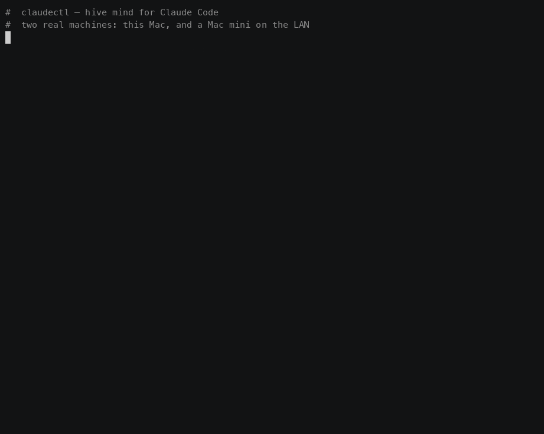

<p align="center">
  
</p>
<p align="center"><strong>Hive mind for Claude Code - expand your consciousness with an agentic hive that learns from you once and remembers everywhere</strong></p>

[](https://github.com/mercurialsolo/claudectl/actions/workflows/ci.yml)
[](https://crates.io/crates/claudectl)
[](https://github.com/mercurialsolo/homebrew-tap)
[](LICENSE)
[](https://crates.io/crates/claudectl)
[]()

<sub>~6 MB binary (full features, Homebrew bottle). Sub-50ms startup. Zero config required.</sub>

[Website](https://mercurialsolo.github.io/claudectl/) | [Docs](https://mercurialsolo.github.io/claudectl/quickstart/) | [Blog: Why a local brain?](blog/local-brain-architecture.md) | [Releases](https://github.com/mercurialsolo/claudectl/releases)



<sub>Real capture, two machines on one LAN: a MacBook discovers the hive hosted on a Mac mini, asks to join, the owner approves, and the brains start exchanging what they learned. Recorded with asciinema — the cast is <a href="assets/hive-demo.cast">assets/hive-demo.cast</a>.</sub>

## What it does for you

Run `claudectl --brain-stats impact` to see your numbers:

```
  ╔════════════════════════════════════════════════╗
  ║              IMPACT SCORECARD                  ║
  ║             1200 decisions tracked             ║
  ╠════════════════════════════════════════════════╣
  ║  Auto-handled                             71%  ║
  ║  ████████████████████░░░░░░░░  847/1200        ║
  ║                                                ║
  ║  Brain accuracy                          96.2%  ║
  ║  ███████████████████████████░  1154/1200       ║
  ║                                                ║
  ║  Coverage vs static rules               2.9x  ║
  ║  brain ████████████████████████████  100%      ║
  ║  rules █████████░░░░░░░░░░░░░░░░░░░  34%      ║
  ║                                                ║
  ║  Dangerous ops blocked      12  Time saved 42m  ║
  ║  2 critical | 10 high-risk | 847 auto x 3s    ║
  ║                                                ║
  ║  Learning: correction rate 8.4% ↓ 2.1% (-6pp) ║
  ╚════════════════════════════════════════════════╝
```

## Install

```bash
brew install mercurialsolo/tap/claudectl     # Homebrew (macOS / Linux)
cargo install claudectl                       # Cargo (any platform)
```

Both produce the same ~6 MB binary with bus/coord/relay/hive enabled — `claudectl bus`, `coord`, `relay`, and `hive` work out of the box. For the minimal ~3.5 MB sync-only build, opt out with `cargo install claudectl --no-default-features --features hive`.

Building from source (Cargo) requires **rustc 1.88+**. Older toolchains fail with an opaque transitive-dependency error before the build starts — run `rustup update stable` first. The Homebrew bottle ships prebuilt and has no toolchain requirement.

<details>
<summary>Other methods</summary>

```bash
curl -fsSL https://raw.githubusercontent.com/mercurialsolo/claudectl/main/install.sh | sh
nix run github:mercurialsolo/claudectl
git clone https://github.com/mercurialsolo/claudectl.git && cd claudectl && cargo install --path .
```

</details>

## Get started

```bash
claudectl demo                # Guided first-value tour — no live sessions needed
claudectl init                # Onboarding wizard (budget, brain, hooks, bus, skills)
claudectl doctor              # Verify install + runtime health (✓ checklist)
claudectl                     # Live dashboard — see all sessions at a glance
claudectl --brain             # Enable local LLM auto-pilot
```

After `brew upgrade claudectl`, run **`claudectl init --upgrade`** to re-sync hook entries, plugin files, and DB migrations to the new binary. `claudectl doctor`'s `plugin version` row will tell you when this is needed.

The `init` wizard walks five phases — weekly budget, local-LLM brain detection, Claude Code hook install, agent-bus role, and curated skill suggestions. Plugin files (slash commands, supervisor agent, bus MCP server registration) are embedded in the binary and written to `~/.claude/plugins/claudectl/` automatically — no repo clone. Run `claudectl doctor` to verify every piece is wired up, or `claudectl init --check` for the drift report against the onboarding marker.

## Why claudectl

- **Local LLM auto-pilot** — a brain that learns your preferences and auto-approves/denies tool calls. No cloud API.
- **Hive mind** — knowledge distillation, archiving, and curriculum generation. Connect instances to share learnings across machines.
- **Self-improving** — detects friction patterns, suggests rules, and gets smarter with every correction.
- **Multi-session orchestration** — run parallel tasks with dependency ordering and cross-session context routing.
- **Health monitoring** — catches cognitive decay, cost spikes, error loops, and context saturation before they waste money.
- **Works everywhere** — Claude Code plugin for inline use, TUI dashboard for oversight, CLI for automation.

[Full feature comparison](docs/reference.md#comparison)

## Local LLM Brain

The brain observes all your sessions and makes real-time decisions:

- **Approve** safe tool calls automatically (reads, greps, test runs)
- **Deny** dangerous operations before they execute (force pushes, destructive commands)
- **Terminate** sessions that are looping, stalled, or burning money
- **Route** summarized output between sessions so they share context
- **Spawn** new sessions when the brain detects parallelizable work

```bash
ollama pull gemma4:e4b && ollama serve    # One-time setup
claudectl --brain                         # Advisory mode (default)
claudectl --brain --auto-run              # Auto mode: brain executes without asking
claudectl --mode auto                     # Or toggle mid-session (Ctrl+b in TUI)
```

Works with any OpenAI-compatible endpoint: [ollama](https://ollama.com), [llama.cpp](https://github.com/ggerganov/llama.cpp), [vLLM](https://github.com/vllm-project/vllm), [LM Studio](https://lmstudio.ai).

### How the brain learns

The brain learns from **everything** you do — not just brain-involved decisions, but every manual approve, reject, rule execution, and conflict resolution. All data stays on your machine.

| Level | What it learns | Example |
|-------|---------------|---------|
| **Conditional preferences** | Context-dependent rules via decision tree splits | `approve [Bash] "git push" when cost<$5 (n=8)` |
| **Outcome tracking** | Correlates decisions to detect "approved but broke" | Downweights false-positive approvals |
| **Temporal patterns** | Behavioral sequences and time-of-day behavior | `After 3+ errors: user usually denies` |
| **Per-project models** | Separate preferences per project | `[Read] always approve in frontend, usually deny in infra` |
| **Adaptive thresholds** | Per-tool confidence requirements based on accuracy | 90%+ accurate on Read = auto-execute at 0.5 confidence |

### Explain & audit every decision

To leave the brain unattended you need to trust and audit it. Every decision now carries a **"why"** — the source (rule, few-shot, or LLM), the confidence, and the past examples that informed it — surfaced inline in `--brain-query` output and the Brain Review panel.

```bash
claudectl --brain-review           # Triage decisions; press [c] to correct-and-learn in one keystroke
claudectl --brain-export           # Export the decision timeline as Markdown (paste into a PR)
claudectl --brain-export json --project acme   # …or JSON, filtered to one project (or --pid <n>)
```

A one-key **correct-and-learn** in the review view records the right answer as canonical training material, so the next similar decision improves.

### Self-improving sessions

The brain automatically detects friction patterns and suggests workflow improvements:

```bash
claudectl --brain --insights on     # Enable auto-generation (every 10 decisions)
claudectl --brain --insights        # View current insights
```

Detects: friction patterns, error loops, context blowouts, missing rules, accuracy gaps, cost trends. Only new insights are surfaced — the system tracks what you've already seen. Use `/auto-insights` in the Claude Code plugin.

## Claude Code Plugin

Integrates the brain directly into Claude Code sessions — no TUI required.

| Component | What it does |
|-----------|-------------|
| **Brain gate hook** | Queries the brain before every Bash/Write/Edit call |
| `/brain on\|off\|auto` | Toggle brain mode mid-session (or `Ctrl+b` in TUI) |
| `/sessions` | Show all active sessions with status, cost, health |
| `/spend` | Cost breakdown by project and time window |
| `/brain-stats` | Brain learning metrics and accuracy |
| `/auto-insights` | Auto-generated workflow insights |
| `/inbox` | Drain pending agent-bus messages addressed to this session's role |
| `/role <name>` | Set this session's agent-bus role, e.g. `/role frontend` or `/role tester` (auto-detects pid) |

## Headless Mode

Run the full autonomous stack without a TUI. Attach a dashboard from another terminal.

```bash
claudectl --headless --brain --auto-run           # Human-readable events
claudectl --headless --brain --auto-run --json    # Structured JSON events
```

What runs in headless mode:
- Brain inference (approve/deny/route/spawn with adaptive confidence)
- Coordination layer (leases, interrupts, handoffs, memory)
- Context rot prevention (auto-raises compact/stop interrupts when decay detected)
- Rule evaluation and health monitoring

The TUI dashboard can run alongside -- both share state via the coordination SQLite store, brain decision logs, and session discovery.

```bash
# Background daemon
nohup claudectl --headless --brain --auto-run > ~/.claudectl/autopilot.jsonl 2>&1 &

# Attach dashboard in another terminal
claudectl
```

## Coordination Layer

Multi-agent coordination for parallel coding sessions. Prevents duplicate work, manages ownership, and routes context between agents.

Enabled by default. For the minimal sync-only build, use `cargo build --no-default-features --features hive`.

```bash
# Ownership leases — prevent two agents from editing the same file
claudectl coord claim --session sess_1 --path src/app.rs --mode exclusive
claudectl coord release lease_123

# Handoffs — structured context transfer between sessions
claudectl coord handoff --from sess_1 --to sess_2 --task task_1 --summary 'Fix path normalization'

# Interrupts — typed cross-agent signals with delivery modes
claudectl coord raise --type pause --target sess_1 --reason 'lease conflict'
claudectl coord ack intr_123

# Memory — validated patterns promoted from brain decisions
claudectl coord promote --project myproject
claudectl coord context --session sess_1           # Preview injected context

# Inspection
claudectl coord leases                             # Active ownership leases
claudectl coord interrupts                         # Pending interrupts
claudectl coord events                             # Event audit log
claudectl coord metrics                            # Coordination health metrics
claudectl coord eval                               # Run 10 eval scenarios
claudectl coord adapters                           # Registered agent adapters
```

The coordination layer stores state in a local SQLite database (`~/.claudectl/coord/coord.db`) and injects compact context into the brain's prompt before every decision.

## Agent Bus (preview)

A durable directory + mailbox that exposes the running swarm as an MCP server. Agents discover each other (`list_agents`), look up their own role (`whoami`), publish directed messages, and drain their inbox at turn boundaries. Phases 1–4 of the [design spec](docs/AGENT_BUS.md) are shipped.

Enabled by default. Pulls in `rmcp` + a current-thread Tokio runtime, which is why the default binary is ~6 MB; the no-async-runtime invariant is deliberately relaxed for the `bus` feature path. For the minimal sync-only build (~3.5 MB), use `cargo build --no-default-features --features hive`.

```bash
# Bind durable role addresses to working directories
claudectl bus role bind planner ~/work/proj-plan
claudectl bus role bind impl    ~/work/proj-impl
claudectl bus role list

# Directed send + drain
claudectl bus send impl "review the auth diff" --from planner --priority high
( cd ~/work/proj-impl && claudectl bus inbox )

# Resolve which role this cwd is
claudectl bus whoami

# Run the MCP server on stdio (this is what the Claude Code plugin invokes)
claudectl bus stdio
```

The Claude Code plugin registers the bus as an MCP server (`claude-plugin/.mcp.json`) and ships two slash commands: `/inbox` (drain mailbox) and `/role <name>` (e.g. `/role frontend`, `/role tester` — set this session's role). Bindings are PID-keyed when made through the TUI's `Ctrl+R` or `/role`; cwd-keyed for the legacy `claudectl bus role bind <name> <cwd>` flow. The resolver prefers a PID match over cwd-inference, which disambiguates "two sessions in one worktree".

Mailboxes live in `~/.claudectl/bus/bus.db` (SQLite WAL). Message bodies are sanitized at the boundary — a leading `/` is neutralized so a queued message cannot smuggle a slash command into the recipient.

**Full guide:** [Agent Bus](docs/agent-bus.md) — wire-up, role binding, sending and receiving messages, worked planner→implementer example, where state lives, uninstall.

Flow guards (hop limit, per-role rate limit, reserved-role ACL) and the supervisor for long-horizon role persistence are shipped. Pub/sub `subscribe` + claim protocol and the TUI bus view are still in flight. See [AGENT_BUS.md](docs/AGENT_BUS.md#implementation-status) for the per-phase status table.

## Supervisor

Durable, verified task lifecycles on top of the bus. Where the agent bus answers "how do I talk to the swarm?", the supervisor answers "how do I trust the swarm to run unattended overnight?" Submit a task, it lands in a SQLite ledger; the reconciler assigns it via mailbox (or spawns a session if no role is set); declared verifiers (`run` / `brain` / `agent`) gate the move to DONE; a dead session triggers Resume with a recovery prompt that carries autopsy findings forward; health-check signals (stalled, retry loop) become first-class transitions instead of dashboard warnings.

```bash
# One-shot inline submission
claudectl supervisor submit \
  --name "auth-middleware" \
  --cwd ~/work/services \
  --prompt "Add JWT middleware to all API routes" \
  --role backend --budget-usd 3.00

# Batch submission from a TOML file
claudectl supervisor run tasks.toml --dry-run    # preview
claudectl supervisor run tasks.toml              # commit

# Inspect fleet state
claudectl supervisor status
claudectl supervisor status --state RUNNING
claudectl supervisor logs <task_id>              # full transition log + verifier history

# Lifecycle controls
claudectl supervisor cancel <task_id>            # idempotent move to CANCELLED
claudectl supervisor drain                       # stop issuing new assignments
claudectl supervisor undrain                     # resume
```

A `tasks.toml` block carrying every supported field — including the three verifier kinds:

```toml
[[task]]
name        = "auth-middleware"
role        = "backend"
cwd         = "./services"
prompt      = "Add JWT auth middleware to all API routes"
model       = "sonnet"
budget_usd  = 3.00
max_retries = 2
timeout_min = 45

  [[task.verify]]
  run  = "cargo test --all-targets"            # exit code is the verdict

  [[task.verify]]
  brain = "Review the diff for auth-coverage gaps. PASS or FAIL with reasons."
                                                # routed to the local brain — free

  [[task.verify]]
  agent = "Adversarial review: find a request that bypasses the middleware."
  model = "haiku"                               # headless claude -p, own budget
  budget_usd = 0.25
```

Tasks are submittable three ways: this CLI, a `task.created` bus message addressed to the `supervisor` role, or the `submit_task` MCP tool from inside a Claude Code session. All three land as the same SQLite row.

Three load-bearing properties from the design spec:

- **Cattle vs. pets** — a task survives the death of the session executing it; the next attempt is a fresh session that reads the recovery context (original prompt + autopsy + prior verifier failures + tree-state drift warning).
- **Crash-safe by construction** — kill the headless daemon mid-tick, restart, and observed state re-converges from `~/.claudectl/coord/coord.db`. The ledger is the source of truth.
- **Fail-closed verifiers** — a brain/agent verifier whose reply lacks the leading `PASS` / `FAIL:` marker is treated as FAIL. RFC §5 calls this the verifier-is-the-gradient principle: every FAIL output becomes the retry prompt the next attempt sees.

Metrics (team observability): `claudectl supervisor metrics` serves a Prometheus `/metrics` endpoint on `127.0.0.1:9464` (`claudectl_tasks_by_state`, `claudectl_fleet_cost_usd_total`, `claudectl_retries_total`, `claudectl_verifier_pass_rate`) that Grafana or Datadog scrape with no claudectl-specific glue. Each scrape reads the coord DB fresh (WAL), so it runs safely alongside the reconciler. A ready dashboard and the full recipe live in [docs/team-observability.md](docs/team-observability.md).

Policy as code (team guardrails): commit a `.claudectl/policy.toml` to the repo and its `[deny]` commands/tools are enforced by the brain gate at the highest precedence — a developer can't soften them by editing local config. Scaffold with `claudectl --policy init`, inspect with `claudectl --policy`. See [docs/policy-as-code.md](docs/policy-as-code.md).

## Hive Mind & Relay

The brain distills your decisions into shareable knowledge. Connect instances across machines to build a convergent hive mind — then move work, or a whole conversation, to whichever machine is free.

```bash
# Hive knowledge is built-in — view what the brain has learned
claudectl hive status
claudectl hive knowledge
claudectl hive distill                # Condense archive into curriculum

# Relay for cross-machine networking is enabled by default
claudectl relay invite                # Generate an invite code
claudectl relay join YCU-AIG-EAH-CC7-GUK-RYW-ZB4  # Join from another machine
claudectl relay discover              # Scan LAN for nearby instances
claudectl relay install-agent         # Keep the relay running across logout

# Run a relay on each machine, then see every session on either one
claudectl relay serve                 # leave running on both machines
claudectl relay fleet                 # every session across the cluster
claudectl relay delegate mac-mini "run the full test suite" --cwd ~/code/app

# Move a conversation to another machine and carry on there — or press `S`
# on the session in the TUI and pick the machine from the list
claudectl relay send-session mac-mini <session-id>
claudectl relay sessions              # what went where, and how to resume it

# Remote sessions also appear in the TUI as [worker-id] project-name.
# The coordinator's HTTP API serves the same unified view to a dashboard:
claudectl relay serve --http-port 9876 --auth-token secret
# GET /api/sessions across all workers. Binds 127.0.0.1 — it is plaintext with
# a bearer token, so forward the port for an off-machine dashboard.
```

### Name a hive, and it becomes joinable

By default a hive has no name — it is whatever your relay peers happen to be. Naming one makes it something you can advertise, find and join *as such*, and lets you decide who gets in:

```bash
claudectl hive identity set --name barrys-hive --join-policy ask
claudectl hive discover               # named hives on the LAN, with peer/unit counts
claudectl hive invite                 # a link, a code, or a word phrase (--qr, --words)
claudectl hive join cctl://hive/hv_3a9f21?a=...   # from another machine
claudectl hive requests               # who is waiting; approve <peer> / deny <peer>
```

**The host decides, not the link.** With `--join-policy ask`, holding an invite gets you queued for approval rather than admitted. `invite` admits a paired peer that asks; `open` warns you about what it exposes and records your confirmation before it will advertise as open.

**Read-only membership.** A `hive.read` capability grant admits someone who receives your hive's knowledge and can never contribute any — useful for a contractor or a colleague you want to teach without being taught by:

```bash
claudectl access grant --scopes hive.read --project barrys-hive --label "alice, read-only"
# alice, with both the invite and the grant:
claudectl hive join <invite> --grant cctl_gr_cf827c_...
```

A hive with no name advertises nothing and gates nothing, so none of this changes anything until you opt in.

Knowledge categories (best practices, techniques, workflow patterns) propagate between hive members. Personal patterns (time-of-day habits, cost tolerance) stay local. You control what's shared:

```toml
[hive]
share_categories = ["best_practice", "technique"]
exclude_tools = ["Write"]
max_units = 500
max_prompt_units = 20
```

> **How propagation works.** Both ends of a relay connection offer each other whatever the other has not been sent yet, every 12 seconds, incrementally. One timer covers connect, reconnect, a peer approved after it asked to join, and a unit distilled while the link was down — a machine that joins late catches up on the next tick. Accepted units are re-offered onward up to a hop cap, so knowledge crosses a mesh it was not directly connected to. What it needs is a live relay connection: one machine running `relay serve`, the other dialling it.

See the [full Relay & Hive Mind guide](docs/relay.md).

## Open Cluster — let someone ask about your project

A relay peer is symmetric: it reads your sessions, delegates to you, interrupts you. A **capability grant** is the opposite — scoped, expiring, revocable, read-only. Someone outside your trust boundary (or their Claude) can ask *"how is auth structured?"* and get cited answers, with no way to write, execute, delegate or interrupt.

```bash
# Mint a token for a third party — prints once, store it then
claudectl access grant --project claudectl \
  --label "acme integration review" \
  --scopes project.query \
  --expires 30d

claudectl access list                 # every grant, its state, uses, last use
claudectl access audit gr_a38487      # what that grant actually asked for
claudectl access revoke gr_a38487     # immediate, nothing to restart

# Serve the repo you're in — one process, one project
claudectl query serve                 # 127.0.0.1:8787 by default
claudectl query stdio                 # same surface over MCP
```

Answers are **verbatim doc spans with citations**, never generated prose. They come only from a pre-built index of what git tracks, minus a deny-list covering `.env*`, ssh keys, transcripts, `.claudectl/`, databases and more. Source bodies are never indexed — only `//!` headers, `///` docs and public signatures. There is no code path from a query to an unindexed file, and no write verb anywhere in the surface.

A token for one project returns an opaque `404` for every other. Each grant carries its own rate limit and daily budget, so one noisy caller can't spend another's.

Classification is optional and off unless you set `TYPESAFE_API_KEY`. When on, it routes questions — deny, decline, answer, or escalate to you — but it is never the boundary: it runs *after* scopes and budgets, and answers still come only from the index. Remove it and the surface is blunter, not less safe. It is the one thing in claudectl that sends anything off-machine: the question and one paragraph of `CLAUDE.md`, never index contents or session data.

See [Capability Grants](docs/access.md) and the [Open Cluster spec](docs/open-cluster.md).

## Orchestrate Sessions

Run coordinated tasks with dependency ordering, retries, and cross-session data routing:

```json
{
  "tasks": [
    { "name": "auth", "cwd": "./backend", "prompt": "Add JWT auth middleware" },
    { "name": "tests", "cwd": "./backend", "prompt": "Update API tests. Previous: {{auth.stdout}}", "depends_on": ["auth"] },
    { "name": "docs", "cwd": "./docs", "prompt": "Document the new auth flow", "depends_on": ["auth"] }
  ]
}
```

```bash
claudectl --run tasks.json --parallel
claudectl --decompose "Add auth, write tests, update docs"   # Auto-split into parallel tasks
```

## Session Health Monitoring

Continuously checks each session and surfaces problems in the dashboard:

- **Cognitive decay** — composite 0-100 score tracking degradation over time
- **Proactive compaction** — suggests `/compact` at 50% context, before the 80/90% thresholds
- **Cost spikes** — flags when burn rate exceeds the session average
- **Loop detection** — catches tools failing repeatedly in retry loops
- **Stall detection** — sessions spending money but producing no edits
- **File conflicts** — detects when multiple sessions edit the same file

## Spend Control

```bash
claudectl --budget 5 --kill-on-budget     # Auto-kill at $5
claudectl --notify                        # Desktop notifications on blocks
claudectl --stats --since 24h            # Aggregated cost statistics
```

## Auto-Rules

```toml
[[rules]]
name = "approve-cargo"
match_tool = ["Bash"]
match_command = ["cargo"]
action = "approve"

[[rules]]
name = "deny-rm-rf"
match_command = ["rm -rf"]
action = "deny"

[[rules]]
name = "kill-runaway"
match_cost_above = 20.0
action = "terminate"
```

Rules support matching by tool, command, project, cost, and error state. Deny rules always take precedence.

<details>
<summary>More features</summary>

### Idle Mode

When you step away, claudectl can run pre-configured low-risk tasks. A morning report summarizes what happened.

### Session Lifecycle

Auto-restart sessions on context saturation with checkpoint + summary handoff.

### Record and Share

Press `R` on any session for a highlight reel GIF (edits, commands, errors — idle time stripped). Or `claudectl --record demo.gif` for the full dashboard.

### Launch and Resume

`claudectl --new --cwd ./backend --prompt "Add auth"` or press `n` in the dashboard.

### Filter and Search

`--filter-status NeedsInput`, `--focus attention`, `--search "project"`, `--watch` for streaming.

</details>

## Docs

| | |
|---|---|
| [Quick Start](docs/quickstart.md) | Install, init, first dashboard |
| [Reference](docs/reference.md) | All flags, keybindings, modes |
| [Configuration](docs/configuration.md) | Config files, hooks, rules |
| [Relay & Hive Mind](docs/relay.md) | Connect instances, share knowledge |
| [Capability Grants](docs/access.md) | Scoped read-only access for a third party |
| [Terminal Support](docs/terminal-support.md) | Compatibility matrix |
| [Troubleshooting](docs/troubleshooting.md) | Common issues and FAQ |
| [Contributing](docs/contributing.md) | Setup and guidelines |
| [Changelog](CHANGELOG.md) | Release history |

Design specs — the reasoning, not the current surface:

| | |
|---|---|
| [Open Cluster](docs/open-cluster.md) | Capability grants and the read-only query surface |
| [Agent Bus](docs/AGENT_BUS.md) | Role directory, mailbox, supervisor |
| [Relay & Hive](docs/relay-and-hive.md) | Why transport, coordination and knowledge are three layers |
| [Relay Discovery](docs/relay-discovery.md) | Pairing UX: codes, phrases, QR, LAN |
| [Hive Storage](docs/hive-storage.md) | Tiered knowledge, archive, distillation |

## Community

- Questions or ideas? [Start a Discussion](https://github.com/mercurialsolo/claudectl/discussions)
- Found a bug? [Open an issue](https://github.com/mercurialsolo/claudectl/issues/new)
- Share your setup in [Show & Tell](https://github.com/mercurialsolo/claudectl/discussions/categories/show-and-tell)

## License

MIT
